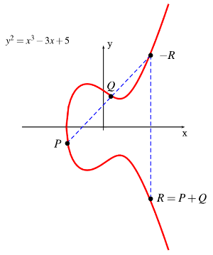

```metadata
tags: algorithm, crypto, ECC, elliptic-curve, key-exchange, DH, ssl
```

## crypto: elliptic curve cryptography (ECC)

Elliptic curve is used in cryptography area for tasks like key exchange, signature.

For key exchange, it works like [Diffie Hellman](./crypto: diffie-hellman-key-exchange.md).

It first defines the operator `+` like following:



So `2P=P+P`, `3P=P+P+P`, `nP=P+P+P+...P`. And the key exchange is similar as following:

- A and B agree on a public point P.

- A has a private number (private key) `a` and he calculates `aP` and sends it to B while
 B has `b` and sends `bP` to A.

- A gets `bP` and multiples it with his private number `a`, then he has `bP*a`. Similarly,
 b can get `aP*b`.

Actually, `bP*a = abP = aP*b`, so both A and B get the same final point (sadly, I don't
 understand the proof of point addition). But the man in the middle can only capture
 `aP` and `bP` but there is no quick way to get `a` and `b` from them. He has to brute
 force but it takes long time.

The private number `a` and `b` are always very large so that it not easy to brute force.
Then it needs to be calculated very quickly. And since `(n+m)P=nP+mP`, we can calculate
 it quickly just like the [fast modular exponentiation](./math: fast modular exponentiation.md).

### X25519 and Ed25519
Both X25519 and Ed25519 are elliptic curves. Parameters of X25519 curve is specially
 chosen and very good at point multiplying so that it is used for ECDH while parameters
 of Ed25519 calculates very fast for signature.

### references
1. [hackernoon: ECC](https://hackernoon.com/what-is-the-math-behind-elliptic-curve-cryptography-f61b25253da3)
2. [brown edu: ECC](https://www.math.brown.edu/~jhs/Presentations/WyomingEllipticCurve.pdf)
3. [stackoverflow: X25519 vs Ed25519](https://crypto.stackexchange.com/questions/27866/why-curve25519-for-encryption-but-ed25519-for-signatures)


