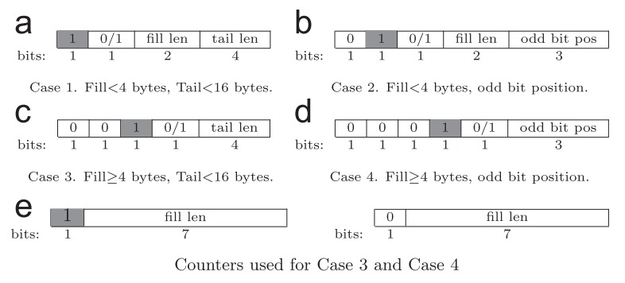

```metadata
tags: data-structure, bitmap, compression, roaringbitmap
```

## bitmap compression and roaringbitmap
`bitmap` is a powerful data structure that frequently used in database system, user
 portrait, recommendation system.

The literal bitmap has a problem. Suppose you have 100,000 attributes and you want to
 label users using these attributes. A user may have very few attributes like 10 or 100.
 But you still needs 100,000 bits, about 12.5kb, for each user. But there are only very
 few bits set.

You can compress the whole bitmap as binary using gzip or other ordinary compssing algorithm
 so that it uses very few space but then you can't do bit operations like AND, OR, XOR
 with compressed binaries directly.

Then there came some compressing algorithm that suite for bitmaps. You don't need to decompress
 whole binary and do bit operations.

### BBC (byte-aligned bitmap code)
BBC is a byte-based compression schema. The whole bitmap is divided into multiple runs.
Run's layout is [header/fill/tail]. BBC has 4 kinds of run as
 .

The fill bit can be 0 or 1. The tail length means that how many normal bytes is at end of
 the run.

The case b and case d has odd bit position. The odd bit indicates the the odd one in the
 filling bits.

### WAH (word-aligned hybrid code)
For WAH algorithm, it has two kinds of words: literal word and fill word (a word is
 32 bit or 64 bit according OS and architecture). The MSB(most significant bit) is used to
 distinguish the two types. For example, 0 means literal word while 1 is fill word.

For literal word, the left 31 or 63 bits are literal like normal bitmap.

For fill word, the second MSB means which to fill, 0 or 1. The left 30 or 62 bits means
 how many bits to fill.

Following is an example of mapping between WAH bitmap and literal bitmap. For each
 literal word (MSB is 0), it is just 31 bits bitmap as normal. The second one is a fill
 word since MSB is 1 (0x80=1000 0000). The second MSB is 0 so it means that we need to fill
 with 0. And the value of left 30 bits is 2. It means fill 2 literal words with 0, thus
 2*31=62 bits of 0.

```
WAH words:   40 00 03 80    80 00 00 02    00 1F FF FF
             literal word   fill word      literal word
RAW words:   W1 (31 bits: 1*1, 20*0, 3*1, 7*0) W2(62*0) W3(10*0, 21*1)
```

By this way, for sparse bitmap like above example, you need 12.5kb for literal bitmap. But
 with WAH bitmap, you may only need few words.

So we know that WAH really compresses a lot. But how about bit operations?

WAH needn't to decompress whole bitmaps to do bit operations. Just loop over two WAH bitmap
 word by word. For two literal words, do normal bit operations. For literal word and fill
 word, expand the fill word one by one and do normal bit operations.

You can read paper in Ref 1 to get details about WAH.

There is a WAH implementation using C in Ref 2.

### roaring bitmap
The BBC, WAH and EWAH do providing good compressing and also supporting some bit operations.
But it is O(N) when you want to get bit at index M, or operations like intersection, union
 since the filling length varies so much.

However, the roaring bitmap supports all these. It divides the whole value space into equal
 chunks whose capacity is 2^16, the first is 0 to 2^16-1, second is 2^16 to 2^17-1. Since each
 chunk has a fixed value space, it's O(1og(N)) to get the chunk of a specific value. And
 intersection and union are O(min(B1, B2)).

Each chunk is represented by a container. And the container has different internal implementations
 due to density of values. For example, it uses literal bitmap if the chunk has more than
 4096 values (>= 6.25%). For sparse values, it simply uses an array to store them all.

You can get details in Ref 4.

Roaringbitmap is used in a lot of famous projects, like Druid, Spark, Hive, Clickhouse, Solr
 and Elasticsearch. Postgres also has extension for it. And a lot of implementations using
 popular languages are linked in homepage.

### references
1. [paper: compressing bitmap index - WAH](https://sdm.lbl.gov/~kewu/ps/LBNL-49627.pdf)
2. [github: source code of BBC, WAH](https://github.com/alexander-io/Bitmap-Engine/tree/master/BitmapEngine/src)
3. [paper: super byte-aligned hybrid bitmap compression](https://dbs.snu.ac.kr/papers/sbh16.pdf)
4. [paper: consistently faster and smaller compressed bitmaps with roaring](https://arxiv.org/pdf/1603.06549.pdf)
5. [roaringbitmap home page](https://roaringbitmap.org/)
