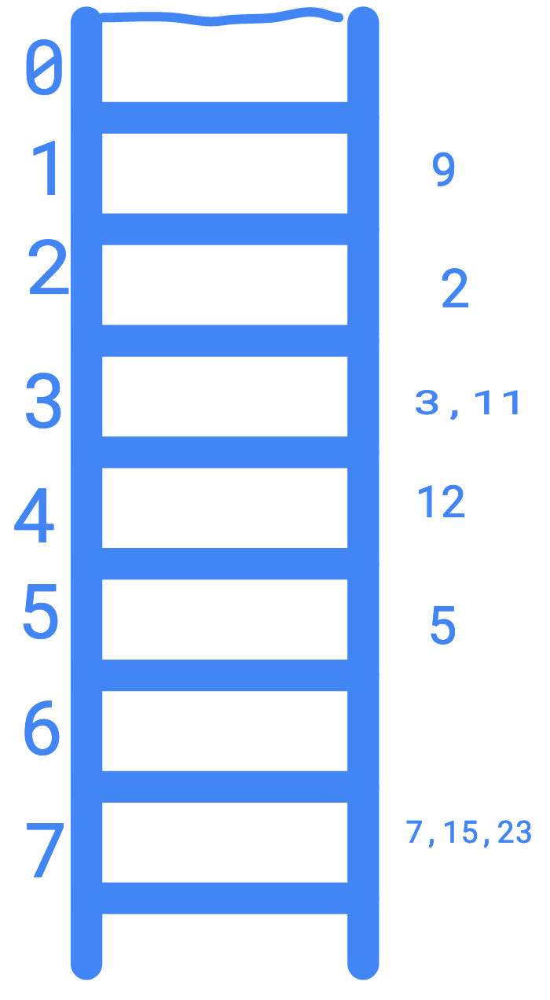

```metadata
tags: data-structure, hash
```

## hash and order

I've interviewed a lot of people recently for a frontend position. I won't ask use
 complex algorithms like rbtree or MST to test coding skill. I'd choose a simple
 question:

    For a ordered array like [1,1,5,5,5,6,9,9], deduplicate it and keep the order.

Many interviewees write code like following quickly:

```js
function dedup(sortedArray) {
    return [...new Set(sortedArray)]
}
```

In this article, I won't talk about the better O(n) solution for this. I'll talk
 about hash, map and set.

For above code, we know that `Set`, `Map` or `object` could be used to deduplicate
 keys since key of them are unique.

However, is the array converted from `Set` ordered? And why?

To answer this question, we need to the underground data structure of `Set`, `Map`
 and `object`.

### hash table
The `Set`, `Map` or `Dict` are common data structures in most languages. The hash
 table is used in most implementations. And it has following advantages:

- O(1) for get, set, add and delete.
- key or member is unique.

#### how
We know that get and set or array by index is O(1) since each element in array is
 fixed size.

```
    | 0 | 1 | .... | i |i+1|i+2|....
```

Hash table use array internally to store key value pairs. When you get or set via
 key, it uses a hash function that convert the key to integer and then do modular
 with array length to get the bucket of the key.

However, different keys may go to same bucket if they got same hash result or same
 modular result. Then how to deal with this?

Generally, there are open address hash table and linked hash table. The open address
 hash address will try to find another bucket if current one is used while the linked
 hash table will use a linked list to store all key value pairs hashed into same bucket.

Following picture shows the linked hash table.



Then we can find a insteresting result:

    the inserting order doesn't effect order too much, it's the hash method does

### ordered hash table
Iterating a hash table is just go throuth the underground array from beginning. Let's
 get back the beginning story.

    Is the array converted from `Set` ordered? And why?

Now you may think that they are NOT ordered since each member is hashed to insert into
 the bucket. However, when testing with javascript, you may find that they are ordered
 each time. What's wrong here?

Some languages use the ordered hash table for some data structures. Python uses it for
 dict from python 3.6 and javascript v8 uses it for `Set` and `Map`.

So what is ordered hash table?

Ordered hash table will store each key value pairs in inserted order so that iterating
 result is stable and ordered.

#### how
There are different implementations for ordered hash table. The main idea is splitting
 the hash table to two parts: a basic hash table and an array to store key value pairs.

Insert steps of the python implementation:

- new element is pushed at the end of the data array, suppose the index is M
- calculate the hash bucket, suppose result is N
- then in bucket N of the basic hash table, stores the index M

Search steps of the python implementation:

- calculate hash bucket and get the index M
- get the key value pairs in Mth element of the data array

With this method, elements in data array are kept as inserting order.


#### inserting order
Attention, the `order` in ordered hash table means iterating will use inserting order.
 It doesn't mean that you'll get ascending or descending order.

For example, iterating `new Set([3,2,1])` will get `3,2,1` but not `1,2,3`.

Following is document about `Map` from javascript reference of MDN. It specifies that
 iterator will use insertion order.

```
Map.prototype.keys()
    Returns a new Iterator object that contains the keys for each element in the Map object in insertion order.
Map.prototype.values()
    Returns a new Iterator object that contains the values for each element in the Map object in insertion order.
Map.prototype.entries()
    Returns a new Iterator object that contains an array of [key, value] for each element in the Map object in insertion order.
```

### references
- [mozilla: deterministic hash table](https://wiki.mozilla.org/User:Jorend/Deterministic_hash_tables)
- [MDN: javascript reference Map](https://developer.mozilla.org/en-US/docs/Web/JavaScript/Reference/Global_Objects/Map)
