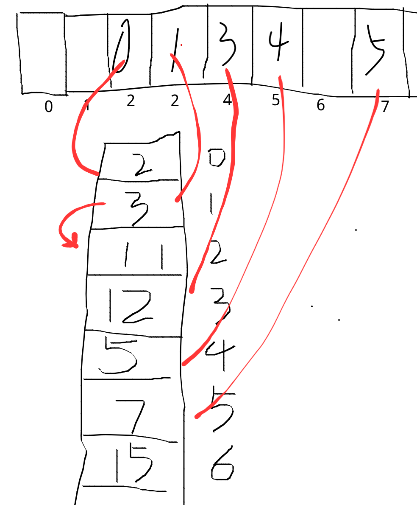

```metadata
tags: data-structure, hash table
```

## hash table and order

I've interviewed a lot of people recently for a frontend position. I won't ask about
 complex algorithms like rbtree or MST to test coding skill. I'd choose a simple
 question:

    For a ordered array like [1,1,5,5,5,6,9,9], deduplicate it and keep the order.

Many interviewees write code like following quickly:

```js
function dedup(sortedArray) {
    return [...new Set(sortedArray)]
}
```

For above code, we know that `Set`, `Map` or `object` could be used to deduplicate
 keys since keys in them are unique.

However, is the array converted from `Set` ordered? And why?

From article [hash table](./hash table.md) we know that `Map` and `Set` are implemented
 using hash table mostly. And keys are converted to array index via hashing and modulus.
So that the order of elements in array has nothing to do with the order of keys themselves
 or inserting order.

Then can we conclude that iterating order of `Map` and `Set` is undetermined?

However, let's see following two examples: python example and js example that convert
 array to set and then to array.

``` python
>>> list(set([1,2,3,4]))
[1, 2, 3, 4]
>>> list(set([4,3,2,1]))
[1, 2, 3, 4]
```

According the python example, it seems that the origin order of the list doesn't matter.

```js
> [...new Set([1,2,3,4])]
[ 1, 2, 3, 4 ]
> [...new Set([4,3,2,1])]
[ 4, 3, 2, 1 ]
```

The js example seems different from python's. It keeps the inserting order. So why? Should
 it behavior as python according to hash table features?

### ordered hash table
Iterating a hash table is just go throuth the underground array from beginning. Let's
 get back the beginning story.

    Is the array converted from `Set` ordered? And why?

Now you may think that they are NOT ordered since each member is hashed to insert into
 the bucket. However, when testing with javascript, you may find that they are ordered
 each time. What's wrong here?

Some languages use the ordered hash table for some data structures. Python uses it for
 dict from python 3.6 and javascript v8 uses it for `Set` and `Map`.

So what is ordered hash table?

    Ordered hash table will store each key value pairs in inserted order so that iterating
    result is stable and ordered.

#### how
There are different implementations for ordered hash table. The main idea is splitting
 the hash table to two parts: a basic hash table and an array to store key value pairs.

Insert steps of the python implementation:

- new element is pushed at the end of the data array, suppose the index is M
- calculate the hash bucket, suppose result is N
- then in bucket N of the basic hash table, stores the index M

Search steps of the python implementation:

- calculate hash and got bucket N, read its value as M
- get the key value pairs in Mth element of the data array

With this method, elements in data array are kept as inserting order.



#### inserting order
Attention, the `order` in ordered hash table means iterating will use inserting order.
 It doesn't mean that you'll get ascending or descending order.

For example, iterating `new Set([3,2,1])` will get `3,2,1` but not `1,2,3`.

Following is document about `Map` from javascript reference of MDN. It specifies that
 iterator will use insertion order.

```
Map.prototype.keys()
    Returns a new Iterator object that contains the keys for each element in the Map object in insertion order.
Map.prototype.values()
    Returns a new Iterator object that contains the values for each element in the Map object in insertion order.
Map.prototype.entries()
    Returns a new Iterator object that contains an array of [key, value] for each element in the Map object in insertion order.
```

### references
- [mozilla: deterministic hash table](https://wiki.mozilla.org/User:Jorend/Deterministic_hash_tables)
- [MDN: javascript reference Map](https://developer.mozilla.org/en-US/docs/Web/JavaScript/Reference/Global_Objects/Map)
