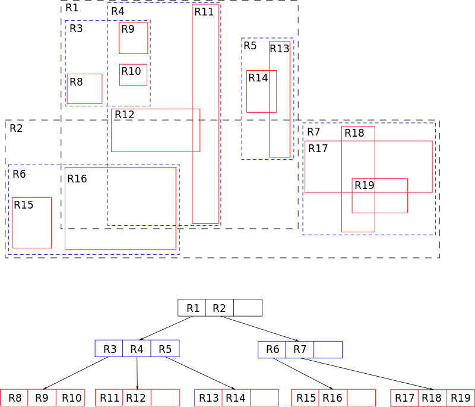

```metadata
tags: data-structure, tree, r-tree
```

## r-tree introduction

R-tree is similar to b-tree but for indexing multi-dimensional data especially
 geographical data.

Mult-dimensional data is something like `(x,y,z)`. You may think that b-tree can
 also support indexing it. Yes, but b-tree treats it as single dimension. It must
 compare `x` first, then `y` then `z`. If you want to search data range of
 `y in (10,20)` or `z in (0,5)`, the b-tree index won't work, it has to scan the
 whole tree.

However, r-tree works very well in this situation. For each non-leaf node, each
 member has a minimum bounding rectangle (MBR) that contains all sub-nodes. So to
 traverse the r-tree, firstly, you'll check whether the queried range is overlapped
 with the MBR. If yes, you need to traverse its sub-nodes, otherwise, you can skip
 them.

A r-tree structure from [wikipedia](https://en.wikipedia.org/wiki/R-tree)



Different from the single-dimensional b-tree, MBR of each member may overlap with
 each other. Then you need to traverse sub-nodes of each matched member.

### split
R-tree also has a max member limit. It will split if the node reaches this limit.
The split algorithm will try best to find a good split boundary so that sum of
the two splitted nodes is as small as possible.

### merge
Just like b-tree, if you remove data from nodes, there may be too few members in nodes
 and it leads to the merge that will merge two nodes to a single one. This is simple.

### references
- [emory.edu: r-tree](http://www.mathcs.emory.edu/~cheung/Courses/554/Syllabus/3-index/R-tree.html)
- [cuhk.edu.hk: r-tree](https://www.cse.cuhk.edu.hk/~taoyf/course/infs4205/lec/rtree.pdf)
