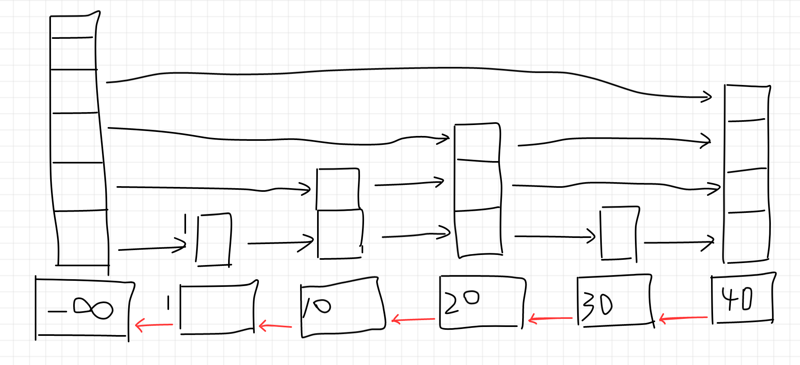

```metadata
tags: data-structure, skiplist
```

## skip list

I learnt about skiplist while reading source code of redis. The sorted set is implemented
 by a hash table and a skip list. The hash table assures the uniqueness while the skip
 list maintains the orderness.

I think you can get same effect using btree or rbtree. But the author explained about
 the reason that he chose skip list as following at
 [hacknews](https://news.ycombinator.com/item?id=1171423):

```
There are a few reasons:

1) They are not very memory intensive. It's up to you basically. Changing parameters about the probability of a node to have a given number of levels will make then less memory intensive than btrees.

2) A sorted set is often target of many ZRANGE or ZREVRANGE operations, that is, traversing the skip list as a linked list. With this operation the cache locality of skip lists is at least as good as with other kind of balanced trees.

3) They are simpler to implement, debug, and so forth. For instance thanks to the skip list simplicity I received a patch (already in Redis master) with augmented skip lists implementing ZRANK in O(log(N)). It required little changes to the code.
```

In my opinion, skip list is really easy to implemented and understand. But I'd prefer
 B+btree if I can choose.

I drew a simple image of skip list like following:



Each node of the skip list has N (N>=1) levels. The N=1 level acts as linked list that
 each points to the next node.

The N>1 levels act as index. You can utilize it to position a node quickly.

When you need to find a node, you begin from top of the head (the first one). If you are
 greater than the right one it points to, then go to the right one. Otherwise go down a
 level and compare to the right one.

Loop the above steps and you'll get level 1 and finally get the node (or position) you
 want.

I drew a `-∞` (-infinity) for the head node as the guard node so that every node is greater
 than it.

To insert a new node, just find the node before it and add it after that.

### levels
Each node has a level of at least 1. But what exactly value should it be? Redis use the
 following function to calculate the level when inserting a new node.

So it has 3/4 probability to be 1, 3/16 probability to be 2, 3/64 probability to be 3,
3/(4^n) probability to be n. It's like btree with 4 children. You can adjust `ZSKIPLIST_P`
 to change the probability model.

```c
int zslRandomLevel(void) {
    int level = 1;
    while ((random()&0xFFFF) < (ZSKIPLIST_P * 0xFFFF))   // ZSKIPLIST_P = 0.25
        level += 1;
    return (level<ZSKIPLIST_MAXLEVEL) ? level : ZSKIPLIST_MAXLEVEL;
}
```

### double link
Redis uses a `backward` member which points to previous node so that it can do reverse
 iterating. This `backward` pointer together with the `forward` pointer in level 1 make
 the skip list to be a double linked list. The `zrevrange` related commands depend on
 it.

### level span and find node by index
We know that `find by index` is O(n) for linked list. But redis claimed that time
 complexity for `ZRANGE key start stop` is `O(log(N)+M) with M is elements to be returned`.
Is there any magic in redis's iemplementation of skip list?

Redis stores an extra `span` value in each link level. The `span` value indicates how
 many nodes are there between the node and the linked node. So for level 1 link it is
 always 1.

By this way, you can quickly position a node by index using same way of finding a node
 by score.

### concurrent skip list
Java has a concurrent skip list: `java.util.concurrent.ConcurrentSkipListMap`. Lockless
 skip list is easy since you don't need to setup the index levels at the same time of
 the inserting. Other threads can still use old indexes to find all nodes correctly,
 it may be a little slowly without index.

#### concurrent insert/delete for linked list
It's easy to insert with CAS instruction. Just prepare a new node with `forward` pointer
 points to next node. And then use CAS to set previous node's `forward` pointer to this
 new node.

It's a little complex for deleting. You cannot simply set `forward` pointer to jump the
 deleted node using CAS. Another thread may occasionally insert a new node after the
 deleted node. Simply jump the `forward` pointer will make this newly added node also
 deleted.

One method is inserting a null node as marker after the deleted node first. So that all
 other threads should not insert before this null node (just spinning here). By this way
 we can sure no inserting will happen after deleted node. Then delete it together with
 null node using CAS.

### references
- [hacknews: the skip list](https://news.ycombinator.com/item?id=1171423)
- [java: concurrent skip list](https://github.com/openjdk/jdk/blob/master/src/java.base/share/classes/java/util/concurrent/ConcurrentSkipListMap.java)
