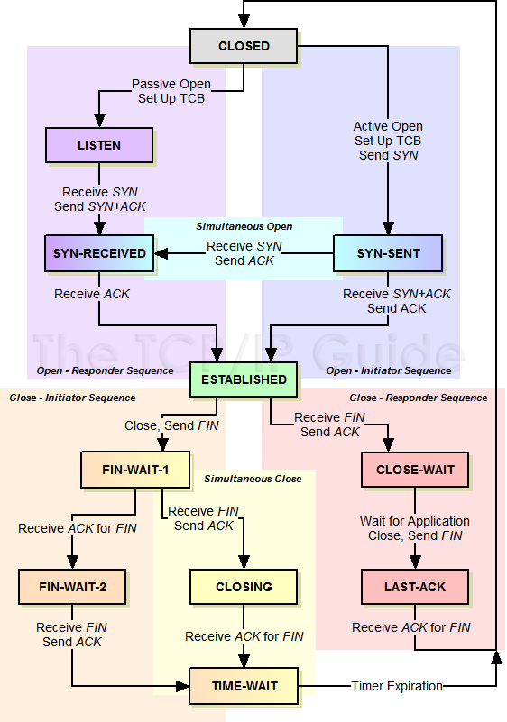

<!---
tags: linux, network, tcp
-->

### tcp state transition diagram
Following is the TCP state transition diagram from internet.



It shows that the client or server whom sent FIN first will go to the TIME-WAIT
 state. So why there is a TIME-WAIT state?

If one side sent FIN and received ACK it will enter into FIN-WAIT-2 state.
Then if it received FIN from another side, it needs to send ACK to tell another
 side that it had received the FIN then the connection is closed in two sides
 successfully.
However, due to complex network situation, the ACK to FIN may not be recevied
 by another side and the other side will resend the FIN.
Without the TIME-WAIT, then the other side will still wait for the ACK and not
 closed. While with the TIME-WAIT, we'll get the resent FIN and then we know
 the ACK is failed then we can retry it.

### address in use and TIME-WAIT
There is a problem with the TIME-WAIT state, you cannot reuse the same port if
 there is bound socket in TIME-WAIT state easily. The `bind()` function will
 get `EADDRINUSE` error.

Write a simple python script as following:

```python
    s = socket.socket(socket.AF_INET, socket.SOCK_STREAM)
    s.bind((host, port))
    s.listen(10)
    conn, addr = s.accept()
    print('get a connection', conn, addr)
    conn.close()
```

Then use `netcat` to connect it `nc 127.0.0.1 20000`. The python script will
 receive the connection and exit normally. Since the python server close connection
 first. The socket will enter into TIME-WAIT. And this socket is considered bound
 to the port by the OS. If you try to start the script againt, you'll get error:

    OSError: [Errno 48] Address already in use

Then you need to wait the 2MSL to start the server again. That's 1 minute on
 linux by default.

### watch the TIME-WAIT connections
You can use `ss` or `netstat` to get socket related infomation (ss is suggested
 but not work on OSX).

```shell
    # ss -atnp -o state 'time-wait'
    # ss -atnp | grep -i 20000 | grep -i 'time-wait'
    # netstat -atn | grep -i 20000
```

### how to deal with address in use
For client, you can just change to another port. However, server always use fixed
 port. It's terrible for server applications like nginx, flask to wait 1 minute
 to restart. So is there any way to avoid this?

You can set the socket with the `SO_REUSEADDR` option. With this option, application
 can use the port bound to socket that in TIME-WAIT state.

```python
    s = socket.socket(socket.AF_INET, socket.SOCK_STREAM)
    s.setsockopt(socket.SOL_SOCKET, socket.SO_REUSEADDR, 1)
    s.bind((host, port))
```

After add this option, I can restart the script immediately.

### how to check the MSL and can I change it
On linux, you can get the 2MSL from the /proc

    $ cat /proc/sys/net/ipv4/tcp_fin_timeout
    60

And you can also change it by echo the desired number to that file.

### FIN and RST (reset) packet
If one side sent FIN but received a RST packet, then it will go to CLOSE state. And
 there isn't the 2MSL waiting problem.

