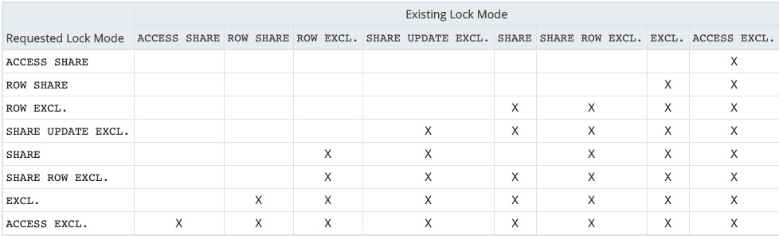

```metadata
tags: postgres, pg-basic, index, reindex, concurrent, lock
```

## pg-basic: create index
You need to be very careful when creating index in production environment since it will
 lock table.

The `create index` command locks table in `SHARE` mode. According to the following lock
 mode conflict table, it only allows table lock of mode `ACCESS SHARE` (`SELECT`),
 `ROW SHARE` (`SELECT FOR UPDATE/SHARE`) and `SHARE` (another create index).



Therefore, it blocks common statements like `INSERT`, `UPDATE` and `DELETE` which need
 table lock of `ROW EXCLUSIVE` mode.

#### create index concurrently
To avoid blocking of DML, postgres adds the `concurrently` modifier for `CREATE INDEX`
 command. It only locks table in `SHARE UPDATE EXCLUSIVE` mode which allows `ACCESS SHARE`,
 `ROW SHARE` and `ROW EXCLUSIVE`. Therefore, DML is allowed.

Since `SHARE UPDATE EXCLUSIVE` conflicts with itself, two `create index concurrently`
 are not allowed at the same time. And normal `create index` is also not allowed.

This is always preferred way of an online database system.

### reindex concurrently
You may want to rebuild an index due to index bloating or corrupting. Before postgres 12,
 you need to create a new index concurrently and then drop the old one. But from postgres
 12, the `reindex` command also supports the `concurrently` modifier so that you can
 simple rebuild with `reindex index concurrently xxx` or `index table concurrently xxx_table`.

### references
- [postgres official doc: table lock](https://www.postgresql.org/docs/current/explicit-locking.html)
- [postgres official doc: reindex](https://www.postgresql.org/docs/12/sql-reindex.html)
