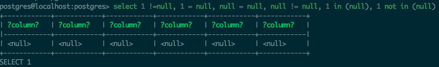

这篇写的是postgres，但是实际上我简单试了**对于mysql也是适用的**.

先简单介绍下背景，这是前几天线上的一个真实bug. 很久之前产品经理要求某个列表页排除某些类型，开发一气呵成写完上线，
非常完美，突然前几天产品说现在不需要排除这几个类别了，就把要排除的配置项给清空了，结果发现列表页也空了，
造成大事故了(其实是小case)。

我检查发现问题代码大致如下

    const products = models.Product.findAll({
        productType: { $notIn: excludedTypeIds },
    })

看着毫无bug是不是？ORM最终出来的的sql大致是

    select * from product where product_type NOT IN (1,2,3,4)

但是考虑下excludedTypeIds是空数组的情况，SQL会变成

    select * from product where product_type NOT IN (NULL)

看着似乎也没问题，这个sql的结果应该是所有product的列表吧？

实际上不是的，这个查询的结果为空。问题就出在NULL上.

在postgresql里，**null是不可比较的**，不管什么跟NULL比较的结果还是NULL，如下

    select 1 !=null, 1 = null, null = null, null != null, 1 in (null), 1 not in (null)
    

这个sql我在mysql里也试了下，结果是一样的.

到这里就很好理解之前的那个 NOT IN (NULL)了，因为这个表达式结果为NULL，那么自然就一行结果都没有了.

最终这个程序要修复就很简单了，如果是空数组就不要添加这个where条件,大致如下

    const where = {}
    if (excludedTypeIds.length) {
        where.productType = { $notIn: excludedTypeIds }
    }
    const products = models.Product.findAll({
        where,
    })

这个处理其实还不是很严格，实际上要考虑数组里可能有null的情况.

最后总结下关于null的其他需要注意的地方

* 基本常识: null判断用`is null`, `is not null`而不是 `id = null`, `id != null`
* `select count(type) from product`这里是没有计算type为null的行的
* `select * from product where type != 1`并不包含type为null的，这个从上面关于null判断里就可以知道了

本文搬运自我的头条号，[原始链接](https://www.toutiao.com/i6712998710827024904/)
