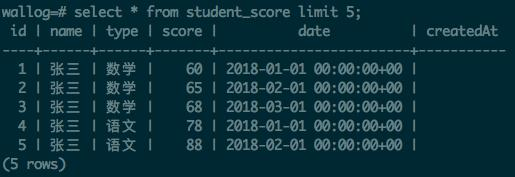
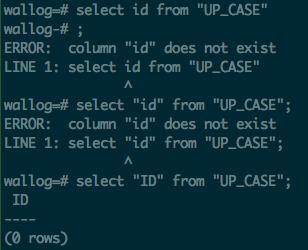

很多人知道postgresql的表名字段名是大小写不敏感的，比如这样一个sql查询

    select ID,name, TYPE, score FROM pubLIC.STUdent_SCOre limit 5

看着很别扭，表名，schema名，字段名大小写混合乱七八糟的，但是用起来一点问题都没有，这就是所谓的大小写不敏感。

不过或许有人注意到有些语言的ORM自动生成的字段如`createdAt`, `updatedAt`似乎是大小写敏感的，比如下面这个sql，
不管是写`createdAt`还是`createdat`都报错，column不存在

    select ID,createdAt FROM public.student_score limit 5

但是`select * from student_score limit 5`可以看到结果里闪亮的`createdAt`

这到底咋回事？

实际上是这样的，postgres库名，schema名，表名，字段名等relations默认都是大小写不敏感的，但是如果你确实想使用大写的，
完全可以，用双引号包住就可以，比如

    create table UP_CASE (ID int); === create table up_case (id int);

但如果把`UP_CASE`用双引号包起来就不一样了

    create table "UP_CASE" ("ID" int);

这个会建一个表名大写的，字段名也是大写的表，这种情况我们使用的时候也需要双引号

    select "ID" from "UP_CASE";

双引号里面就不是大小写敏感的，创建的时候是什么样就需要什么样，比如`select id, "Id", ID`这些都不行，必须`select "ID"`.

这样用起来得多敲很多的双引号，感觉不如小写的方便省事，我想这也许就是为啥通常看到的表很少使用大写的原因吧。

另外说一点，**在postgres里单引号和双引号是完全不能混用的**，上面的情况里表示relation的都是双引号，而sql里表示字段值之类的
用户输入的字符串都是用单引号，比如下面这个张三这里就只能用单引号了, 而表名和字段名需要双引号的

    update "StudentName" set "Name" = '张三'

本文搬运自我的头条号，[原始链接](https://www.toutiao.com/i6702400326743360013/)
