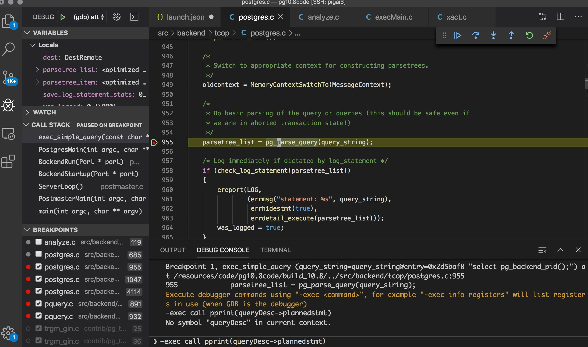

<!---
tags: postgres, vscode, debug
-->

I think setup breakpoints and watch variables in vscode is easy than gdb in the server. I've tried to setup vscode as 
gdb client to connect to remote gdb server but failed although I can connect to same gdb server using gdb client remotely.

Then I tried with the `remote ssh` extension and attached to process easily.

Setup the ssh connection and then choose the source code directory. Then add a new debug configuration like following

```
{
    "version": "0.2.0",
    "configurations": [
        {
            "name": "(gdb) attach",
            "type": "cppdbg",
            "request": "attach",
            "program": "/usr/local/pg10.8/bin/postgres",
            "processId": 985,
            "args": [],
            "stopAtEntry": true,
            "cwd": "${workspaceFolder}",
            "environment": [],
            "externalConsole": false,
            "MIMode": "gdb",
            "setupCommands": [
                {
                    "description": "Enable pretty-printing for gdb",
                    "text": "-enable-pretty-printing",
                    "ignoreFailures": true
                }
            ]
        }
    ]
}
```

It's almost the default config for `C/C++: (gdb) Attach`. Change the `processId` to the pid that you want to attach to.

To debug a normal backend process, I started a psql shell and run `select pg_backend_pid();` to get the pid. Then update 
the pid in the config and start to debug.

Run a simple query like `select 1;` and setup breakpoints. Now you can debug in vscode just like local development.

Screenshot



