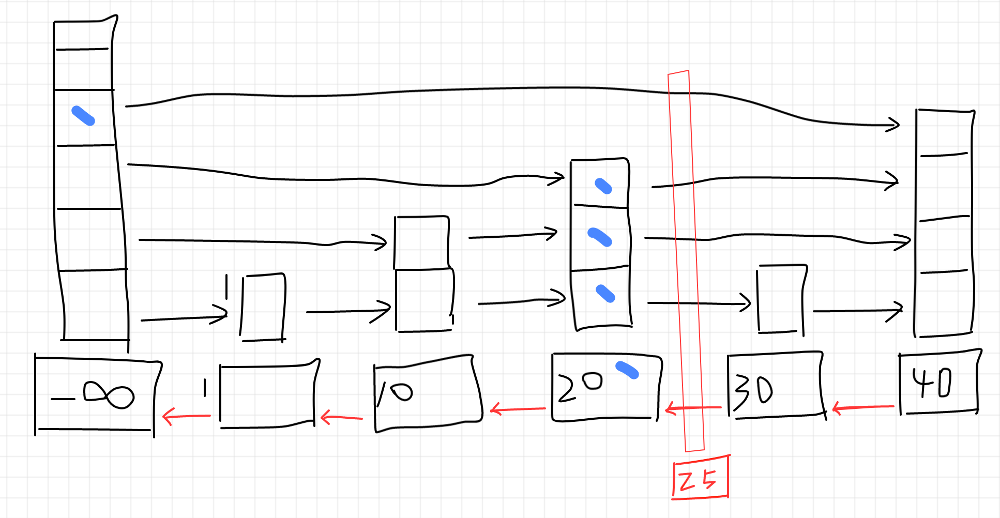

```metadata
tags: redis, sourcecode, skiplist
```

## redis skip list

From article [redis data types](./data types and internal types.md) we knew that redis
 uses `ziplist` for `zset` when the size is small. When you add a lot members into it,
 redis will convert the `ziplist` to `skiplist` + `dict`. The `dict` assures that each
 member is unique while the `skiplist` assures the order.

The article [data structure: skiplist](../data_structure/skip list.md) explained the
 internal picture of skiplist and why redis choose it (actually it can use btree, rbtree
 or other data structures).

### skiplist structures
Following is structure of skiplist and its node.

```c
typedef struct zskiplistNode {
    sds ele;
    double score;
    struct zskiplistNode *backward;
    struct zskiplistLevel {
        struct zskiplistNode *forward;
        unsigned long span;
    } level[];
} zskiplistNode;

typedef struct zskiplist {
    struct zskiplistNode *header, *tail;
    unsigned long length;
    int level;
} zskiplist;
```

Redis adds an extra `backward` pointer to make it double linked list. And the `zskiplistLevel`
 has a `span` member to indicate nodes between two sides of the link so that it can do
 index based query quickly.


### skiplist create
The `zslCreate` initiate the skiplist. It creates a head node with max level as the
 guard. Every other node will be inserted after it.

```c
zskiplist *zslCreate(void) {
    int j;
    zskiplist *zsl;

    zsl = zmalloc(sizeof(*zsl));
    zsl->level = 1;
    zsl->length = 0;
    zsl->header = zslCreateNode(ZSKIPLIST_MAXLEVEL,0,NULL);
    for (j = 0; j < ZSKIPLIST_MAXLEVEL; j++) {
        zsl->header->level[j].forward = NULL;
        zsl->header->level[j].span = 0;
    }
    zsl->header->backward = NULL;
    zsl->tail = NULL;
    return zsl;
}
```

### skiplist insert
For insert, we need to walk through the skiplist from top level of the head to bottom
 level. Insert the new node in the linked list. This will break many upper level links.
 We need to fix them.



Just like above image. We need to record the walking path to fix the links. Links higher
 than the inserted node won't be affected. But those equal to or less than inserted
 are broken to two parts. We need to fix the `rank` of each link too.

```c
zskiplistNode *zslInsert(zskiplist *zsl, double score, sds ele) {
    // the update is used to record the walking path
    zskiplistNode *update[ZSKIPLIST_MAXLEVEL], *x;
    unsigned int rank[ZSKIPLIST_MAXLEVEL];
    int i, level;

    serverAssert(!isnan(score));
    x = zsl->header;
    // walk from top level
    for (i = zsl->level-1; i >= 0; i--) {
        /* store rank that is crossed to reach the insert position */
        rank[i] = i == (zsl->level-1) ? 0 : rank[i+1];
        // try to go right if possible
        while (x->level[i].forward &&
                (x->level[i].forward->score < score ||
                    (x->level[i].forward->score == score &&
                    sdscmp(x->level[i].forward->ele,ele) < 0)))
        {
            rank[i] += x->level[i].span;
            x = x->level[i].forward;
        }
        update[i] = x;
    }
    /* we assume the element is not already inside, since we allow duplicated
     * scores, reinserting the same element should never happen since the
     * caller of zslInsert() should test in the hash table if the element is
     * already inside or not. */
    // level is random calculated for each new nodes with some probability
    level = zslRandomLevel();
    if (level > zsl->level) {
        for (i = zsl->level; i < level; i++) {
            rank[i] = 0;
            update[i] = zsl->header;
            update[i]->level[i].span = zsl->length;
        }
        zsl->level = level;
    }
    x = zslCreateNode(level,score,ele);
    for (i = 0; i < level; i++) {
        // old links broke to two part, x is inserted in the middle
        x->level[i].forward = update[i]->level[i].forward;
        update[i]->level[i].forward = x;

        /* update span covered by update[i] as x is inserted here */
        x->level[i].span = update[i]->level[i].span - (rank[0] - rank[i]);
        update[i]->level[i].span = (rank[0] - rank[i]) + 1;
    }

    /* increment span for untouched levels */
    for (i = level; i < zsl->level; i++) {
        update[i]->level[i].span++;
    }

    x->backward = (update[0] == zsl->header) ? NULL : update[0];
    if (x->level[0].forward)
        x->level[0].forward->backward = x;
    else
        zsl->tail = x;
    zsl->length++;
    return x;
}
```

### delete and update
Delete and update is more simple. Walk through the links to find target node and
 record the paths to update links and spans.

For update, if the new score fits with old position, just update the score. Otherwise,
 old node is removed and a new node is inserted (update=delete + insert).


### references
- [redis source: zset](https://github.com/redis/redis/blob/5.0.0/src/t_zset.c)
