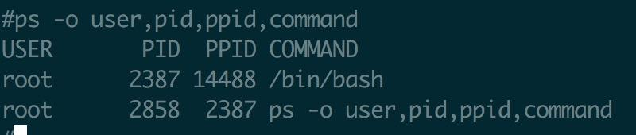
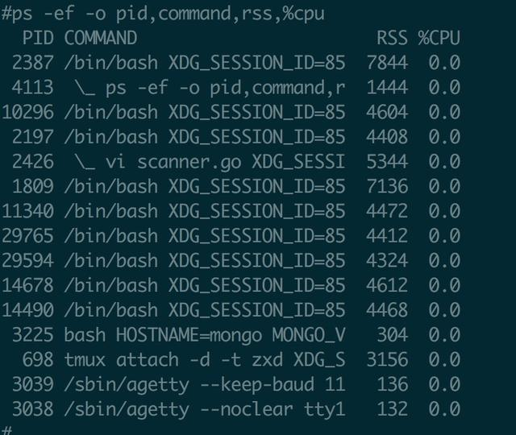
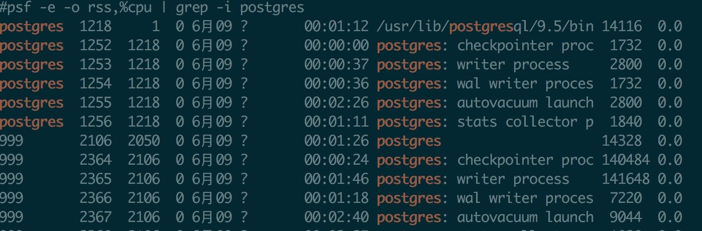

说到查看进程大家都知道用ps，`ps -ef | grep XXX`应该估计每天都得来那么几次吧，但是为什么说不建议用 ps -ef 呢？

其实还好，没啥大问题(略微有一点标题党了)，先看下面几个小问题.

* 如果要查线程怎么查呢？加个-L就可以，ps -efL就可以.
* 如果想在结果列里展示cpu占用率或者内存占用率呢？
* 如果想看进程状态呢？

大家知道可以用-o这个参数来控制结果的展示列，如

那我们用`ps -ef -o pid,command,rss,%cpu`来试试看

这个结果很奇怪，`ps -ef`默认的列完全没有，ps -ef本该展示所有的进程，这里我没有任何grep过滤，但是展示的只是很少一部分的结果.

如果考虑线程的话，试试`ps -efL -o pid,command,rss,%cpu`, 直接报错了

    #ps -efL -o pid,command,rss,%cpu
    error: conflicting format options

这就是我说的为啥不推荐用ps -ef的原因，其实有一个小前提就是当你需要额外的展示一些别的列. 但是不用 ps -ef 的话，
每次都输入一大堆 ps -e -o aa,bb,cc多麻烦，多难记.

我们可以用alias，比如我的一个alias配置

    alias psf='ps -o user,pid,ppid,c,stime,tty,time,command'

这个alias默认展示的列跟ps -f定义的是一致的，设置好之后

    psf -e === ps -ef
    psf -e | grep python === ps -ef | grep python

而且这个就解决了上面的问题，比如我们想看rss和cpu百分比，可以这样

    # psf -e -o rss,%cpu | grep -i postgres

后面两列就是加上去的. 实际上支持的展示列特别多，可以man ps查看，根据需要选用.

最后再提供一个小技巧，下面这样可以查看cpu占用率最高的10个进程

    psf -e -o rss,%cpu --sort -%cpu | head -n 10

`--sort`是控制进程排序，`-%cpu`是按照cpu使用率降序，如果需要按照内存降序是`-%mem`, 如果想升序就是`+%mem`.

本文搬运自我的头条号，[原始链接](https://www.toutiao.com/i6705733307109212676/)
